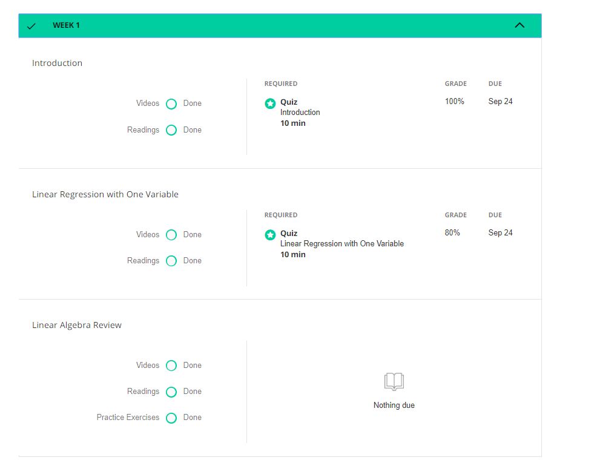
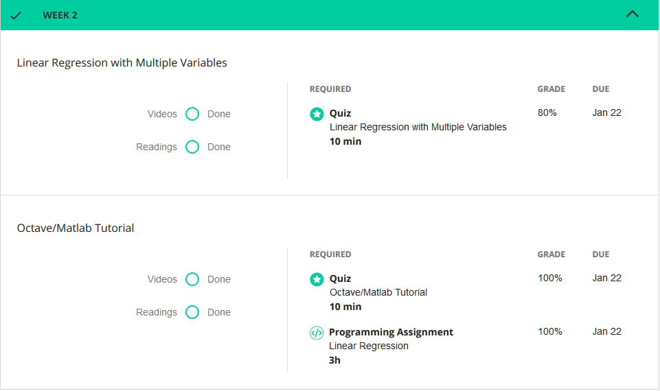
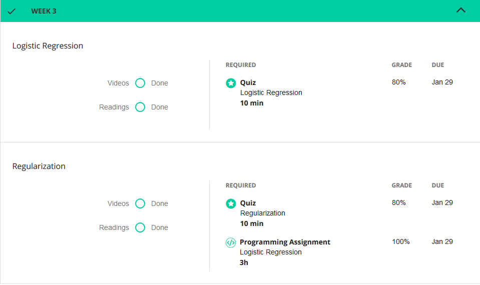
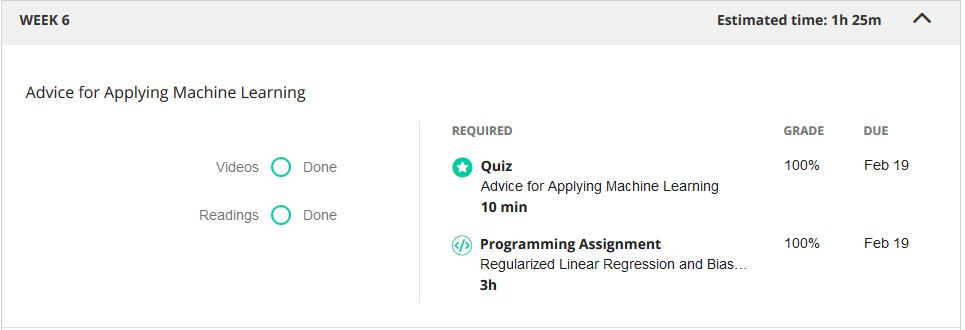

# Online Course Materiaal

oor de minor heb ik twee verschillende Online Courses gedaan, namelijk Datacamp en Coursera. 

### DataCamp
Voor mijn Datacamp course heb ik codeeropdrachten gedaan van kleine projecten van de basis van Python tot het leren van datascience libarys zoals numpy en pandas. 

## Uitleg
| State      | Uitleg
|:------------:|:------------:|
| Completed  | Opdracht afgerond binnen de gezette deadline
| Late       |Opdracht afgerond maar buiten de gezette deadline
| Missed    |Opdracht (nog) niet afgerond
| In progress| bezig met de opdracht

### Coursera
De course ik heb gevold op Coursera is die curses van Andrew Ng, waarin hij de basis van machine learning uitleg. 

Voor mijn Coursera heb ik alle video's gezien en presenaties gelezen. Echter had ik veel moeite met de opdrachten en ik ze niet kunnen doen voordat de deadline verstreek en deze op slot gingen.

#### Week 1

#### Week 2

#### Week 3

#### Week 6

