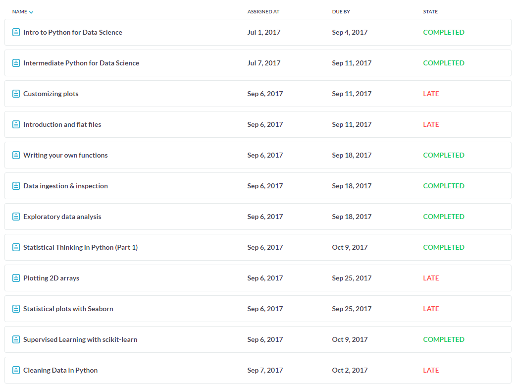

# Portfolio 

**Naam:** Viradj Ramlochan Tewarie

**Studentnummer:** 14071088

**Datum:** 26-01-2018

Het project-team van Urbinn en ik hebben gezammelijk [deze paper](paper/landmark-filtering-techniques-for-semantic-mapping.pdf) geschreven.

-------------------------------

### Table of Content

- [Urbinn Project Intro](#urbinn-project-intro)
- [Online Course Materiaal](#online-course-materiaal)
- [Presentaties](#presentaties)
- [Scrum taken & Tickets](#scrum-taken--tickets)
- [Workshop opdrachten](#workshop-opdrachten)
- [EM_Fields](#em_fields)

------------------------------------------------

## Urbinn Project Intro

De Betafactory, Accenda en het lectoraat Smart Sensor Systems zijn een jaar geleden project gestart om een duurzame zelfrijdende stadsauto te maken. Het doel van dit project wordt om camera beelden te gebruiken om vaste en bewegende obstakels te classificeren zodat deze informatie in een vervolgtraject kan worden gebruikt om het autonoom rijden te onderzoeken. (source: kb74 github pagina 5 okt 2017)
(http://urbinn.nl)

-----------------------------------------------

## Online Course Materiaal

|Naam|Resultaat|Link|
|----|---------|--------|
|DataCamp|Compleet|[link](#Datacamp)|
|Coursera|compleet|[link](#Coursera)|

### Datacamp

#### Uitleg
| Status     | Uitleg
|:------------:|:------------:|
| Completed  | Opdracht afgerond binnen de gezette deadline
| Late       |Opdracht afgerond maar buiten de gezette deadline
| Missed    |Opdracht (nog) niet afgerond
| In progress| bezig met de opdracht

### Coursera

#### Week 1

#### Week 2

#### Week 3

#### Week 6

###### [Online Course Materiaal](/Online_Course_Materiaal)
---------------------------------------------------

## Presentaties

### Alle presentaties

| Week | Datum | Link | Uitleg|
|------|-------|------|-------|
|Week 2|4 september 2017| [Powerpoint](/Presentatie/Week_2/Week_1_Sprint_1.pdf)|[week 2](#Powerpoint_week_2)|
|Week 9|3 november 2017| [Powerpoint](/Presentatie/Week_9/Week_9-Presentatie.pdf)|[week 9](#Powerpoint_week_9)|
|Week 10|10 november 2017| [Powerpoint](/Presentatie/Week_10/Week_10-Presentatie.pdf)|[week 10](#Powerpoint_week_10)|
|Week 15|11 december 2017| [Powerpoint](/Presentatie/Week_15/Week_15-Presentatie.pdf)|[week 15](#Powerpoint_week_15)|
|Week 16|18 december 2017| [Powerpoint](/Presentatie/Week_16/Week_16-Presentatie.pdf)|[week 16](#Powerpoint_week_16)|

## [Powerpoint_Week_2](/Week_2/Week_1_Sprint_1.pdf) 

In de eerste sprint voor het project van EM-fields heb ik in week 2 een presentatie gehouden hierin besprak ik de vooruitgang van onze groep, rollenverdeling en doelen die we hadden uitgezet voor elk teamlid. 

## [Powerpoint_Week_9](/Week_9/Week_9-Presentatie.pdf) 

In week negen heb ik samen met een projectgenoot de presentatie gehouden over de vooruitgang in yolo, op dat moment was yolo vergenoeg getraind om 9 verschillende klasses te herkennen en had een recall van 50%. Daarnaast introduceerde we als groep in deze precentatie het idee om poindclouds (uit de ZED-Camera) te gebruiken voor orb evaluatie. 

## [Powerpoint_Week_10](/Week_10/Week_10-Presentatie.pdf) 

In week negen heb ik samen met een projectgenoot de precentatie gehouden over de tegenslagen in het project. Het is helaas naarvoren gekomen dat URB met nieuwe opnames van de ZED-Camera geen goede resulaten opleverde. In de presenatie hebben we ook laten zien hoe we de BBox-tool hebben gebruikt om foto's te labelen. De BBox-tool is een bestaand stuk software dat is aangepast door een groepsgenoot om zelf foto's te labelen. 

## [Powerpoint_Week_15](/Week_15/Week_15-Presentatie.pdf) 

In deze week vijftien werden de opnames die met de ZED-Camera genomen waren besproken en de koppeling die tussen URB en YOLO zou komen. Ook werden de vooruitgangen met de trjactory evaluation gepresenteerd. Voor YOLO hebben laten zien welke resulaten we kregen met de getrainde dataset van KITTI. 

## [Powerpoint_Week_16](/Week_16/Week_16-Presentatie.pdf) 

In week 16 hebben mijn projectgenoot en ik de problemen gepreseneerd die we kregen met YOLO en URb op de dataset van Delft die werd genomen met de ZED-Camera. Hierin kwam helaas naar voren dat de opnames de slecht belicht waren voor de twee algorites die wel prositive resulaten hadden met de goed belichte en beter opgenomen KITTI-dataset. 

###### [presentatie](/Presentatie)
----------------------------------------------------

## Scrum taken & tickets
 
Alle door deze Issue met uitleg van wat ik hier gedaan heb kunnen *[hier](/Issue_urbinn)* gevonden worden. 

| Issue nummer | Issue Discription|
| -------------|--------------|
| Issue 55 | Object detection papers lezen| 
| Issue 62 | aanpakken die objecten herkennen op basis van photometric differences in stereo images |
| Issue 64 | Evaluatie implementatie: pointcloud vs pointcloud|
| Issue 67 | Tiny Yolo dataset uitzoeken|
| Issue 77 | Presentatie maken + blog updaten|
| Issue 79 | ORB coordinaten converteren |
| Issue 80 | ORB output uitbreiden met keyframe coordinaten|
| Issue 81 | Literatuur scan: filteren slam met object detectie|
| Issue 82 | yolo training data verzamelen |
| Issue 86 | Ground truth nieuwe trainingsdata labelen|
| Issue 94 | Dieptebeeld genereren slinger |
| Issue 99 | LIACS gebruiken voor conversie |
| Issue 100 | Opnamen slinger met kruisjes op grond|
| Issue 101 | Opnemen van beeldmateriaal in de hhs|
| Issue 104 | Opnemen beeldmateriaal van ovaal en buiten |
| Issue 114 | Plan maken opnames Delft|
| Issue 120 | RGB naar Hue (HSV) experiment|
| Issue 124 | Evaluatie handmatig nameten afstanden|
| Issue 133 | Plan van Delft uitvoeren|
| Issue 141 | Selecteren best run delft|
| Issue 142 | Run URB over dataset delft #141|
| Issue 146 | Analyseren URB foute sequences Kitti |
| Issue 152 | 1. Introduction|
| Issue 153 | 2. Related Work|
| Issue 154 | 3. Design|
| Issue 155 | 4. Experiment|

###### [Issue_urbinn](/Issue_urbinn)
-------------------------------------

## Workshop opdrachten

|Naam|Uileg|Opgeleverde_documenten|
|------|---------|------------------------|
|Calling Bullshit|[link](#Calling Bullshit opdrachten)| [bewijsstukken](https://github.com/Viradj/Portfolio-ADS/blob/master/Workshop_opdrachten/Calling_Bullshit/bullshit.pdf)|
|

### Calling Bullshit opdrachten

Calling Bullshit bewijsstukken: [bewijsstukken](https://github.com/Viradj/Portfolio-ADS/blob/master/Workshop_opdrachten/Calling_Bullshit/bullshit.pdf)

### Jupyter notebooks 

Hier kunt u [Jupyter_ExploratoryData](Workshop_opdrachten/Jupyter_ExploratoryData) en [Spark](Workshop_opdrachten/Jupyternotebooks) opdrachten vinden die ik heb gemaakt in Juypterhub. 

###### [Workshop opdrachten](Workshop_opdrachten)

----------------------------------
## EM_Fields

### EM_Fields intro
Sommige mensen klagen over gevoeligheid voor electromagnetische velden (bijvoorbeeld magnetron, zendmasten, Wifi). Om dit te onderzoeken hebben vrijwilligers in Utrecht sensoren gedragen om de bootstelling aan electromagnetische velden te meten. Het blijkt echter dat de metingen bijzonder storingsgevoelig zijn, bijvoorbeeld doordat het lichaam tussen zender en sensor zit. Doel van dit project is te onderzoeken hoe nauwkeuriger kan worden bepaald wat de werkelijke blootstelling aan electromagnetische velden is.
(source: kb47 github pagina 5 oktober 2017)

### EM_Fields einde na drie weken
Aan het begin van mijn minor heb ik gekozen om voor het project EM_Fields, echter bleek het na 3 weken dat de begeleidende docent van dit project niet meer het project kon begeleidien. Helaas was dit project daarom gestop en ben ik overgestaped naar het project van Urbinn. 

Met deze [link](/EM-Fields) kunt u zien wat ik heb kunnen doen tijdens de opstart van dit project.

Overzicht van [EM_Fields](/EM-Fields) 

###### [EM_Fields](EM-Fields)
-----------------------------------------------
