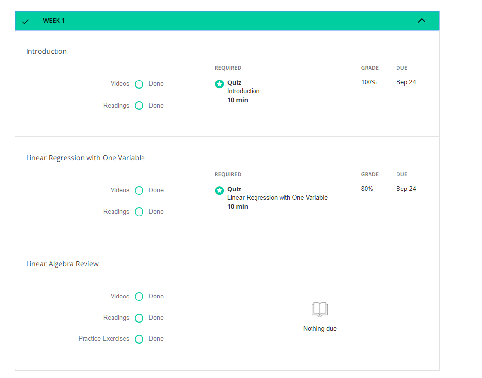
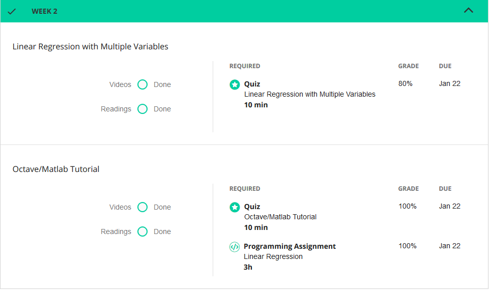
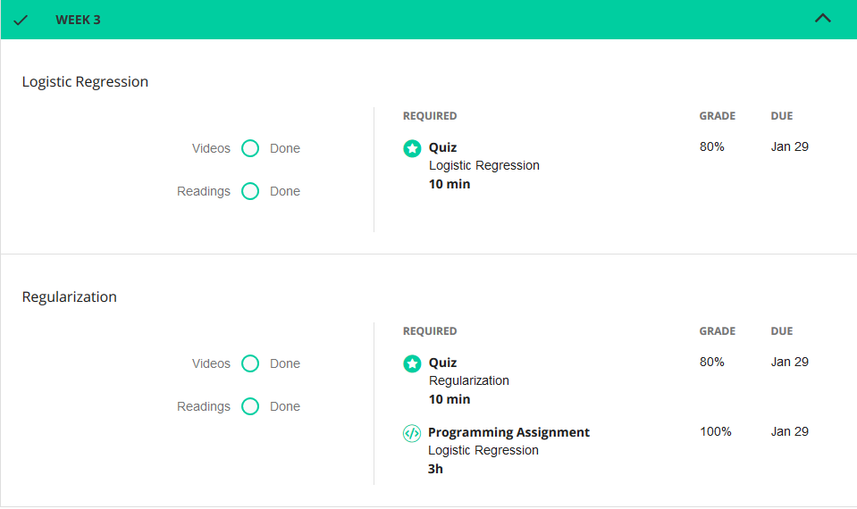
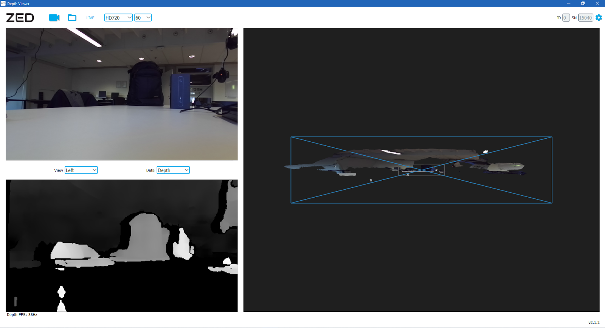

# Portfolio 

**Naam:** Viradj Ramlochan Tewarie

**Studentnummer:** 14071088

**Datum:** 26-01-2018

Het project-team van Urbinn en ik hebben gezammelijk [deze paper](paper/landmark-filtering-techniques-for-semantic-mapping.pdf) geschreven.

-------------------------------

### Table of Content

- [Urbinn Project Intro](#urbinn-project-intro)
- [Online Course Materiaal](#online-course-materiaal)
- [Presentaties](#presentaties)
- [Scrum taken & Tickets](#scrum-taken--tickets)
- [Workshop opdrachten](#workshop-opdrachten)
- [EM_Fields](#em_fields)

------------------------------------------------

## Urbinn Project Intro

De Betafactory, Accenda en het lectoraat Smart Sensor Systems zijn een jaar geleden project gestart om een duurzame zelfrijdende stadsauto te maken. Het doel van dit project wordt om camera beelden te gebruiken om vaste en bewegende obstakels te classificeren zodat deze informatie in een vervolgtraject kan worden gebruikt om het autonoom rijden te onderzoeken. (source: kb74 github pagina 5 okt 2017)
(http://urbinn.nl)


-----------------------------------------------

## Online Course Materiaal

|Naam|Resultaat|Link|
|----|---------|--------|
|DataCamp|Compleet|[link](#Datacamp)|
|Coursera|compleet|[link](#Coursera)|

### Datacamp

#### Uitleg
| Status     | Uitleg
|:------------:|:------------:|
| Completed  | Opdracht afgerond binnen de gezette deadline
| Late       |Opdracht afgerond maar buiten de gezette deadline
| Missed    |Opdracht (nog) niet afgerond
| In progress| bezig met de opdracht


### Coursera

#### Week 1


#### Week 2


#### Week 3


#### Week 6


###### [Online Course Materiaal](/Online_Course_Materiaal)
---------------------------------------------------

## Presentaties

### Alle presentaties

| Week | Datum | Link | Uitleg|
|------|-------|------|-------|
|Week 2|4 september 2017| [Powerpoint](/Presentatie/Week_2/Week_1_Sprint_1.pdf)|[week 2](#Powerpoint_week_2)|
|Week 9|3 november 2017| [Powerpoint](/Presentatie/Week_9/Week_9-Presentatie.pdf)|[week 9](#Powerpoint_week_9)|
|Week 10|10 november 2017| [Powerpoint](/Presentatie/Week_10/Week_10-Presentatie.pdf)|[week 10](#Powerpoint_week_10)|
|Week 15|11 december 2017| [Powerpoint](/Presentatie/Week_15/Week_15-Presentatie.pdf)|[week 15](#Powerpoint_week_15)|
|Week 16|18 december 2017| [Powerpoint](/Presentatie/Week_16/Week_16-Presentatie.pdf)|[week 16](#Powerpoint_week_16)|

## [Powerpoint_Week_2](/Week_2/Week_1_Sprint_1.pdf) 

In de eerste sprint voor het project van EM-fields heb ik in week 2 een presentatie gehouden hierin besprak ik de vooruitgang van onze groep, rollenverdeling en doelen die we hadden uitgezet voor elk teamlid. 


## [Powerpoint_Week_9](/Week_9/Week_9-Presentatie.pdf) 

In week negen heb ik samen met een projectgenoot de presentatie gehouden over de vooruitgang in yolo, op dat moment was yolo vergenoeg getraind om 9 verschillende klasses te herkennen en had een recall van 50%. Daarnaast introduceerde we als groep in deze precentatie het idee om poindclouds (uit de ZED-Camera) te gebruiken voor orb evaluatie. 


## [Powerpoint_Week_10](/Week_10/Week_10-Presentatie.pdf) 

In week negen heb ik samen met een projectgenoot de precentatie gehouden over de tegenslagen in het project. Het is helaas naarvoren gekomen dat URB met nieuwe opnames van de ZED-Camera geen goede resulaten opleverde. In de presenatie hebben we ook laten zien hoe we de BBox-tool hebben gebruikt om foto's te labelen. De BBox-tool is een bestaand stuk software dat is aangepast door een groepsgenoot om zelf foto's te labelen. 


## [Powerpoint_Week_15](/Week_15/Week_15-Presentatie.pdf) 

In deze week vijftien werden de opnames die met de ZED-Camera genomen waren besproken en de koppeling die tussen URB en YOLO zou komen. Ook werden de vooruitgangen met de trjactory evaluation gepresenteerd. Voor YOLO hebben laten zien welke resulaten we kregen met de getrainde dataset van KITTI. 

## [Powerpoint_Week_16](/Week_16/Week_16-Presentatie.pdf) 

In week 16 hebben mijn projectgenoot en ik de problemen gepreseneerd die we kregen met YOLO en URb op de dataset van Delft die werd genomen met de ZED-Camera. Hierin kwam helaas naar voren dat de opnames de slecht belicht waren voor de twee algorites die wel prositive resulaten hadden met de goed belichte en beter opgenomen KITTI-dataset. 

###### [presentatie](/Presentatie)
----------------------------------------------------

## Scrum taken & tickets
Binnen het project van Urbinn hebben we gebruik gemaakt van de tool Waffle. [Dit is een link naar de Waffle tool.](https://waffle.io/urbinn/urbinn)

## Issues
Dit is een overzicht van alle belangrijke Issues waar ik aan heb gewerkt met uitleg.

### Issue 55: Object detection appers lezen
Voor deze Issue heb een paar projectgenoten en ik object detectie papers gelezen. Dit was van belang om de juiste methode te vinden voor een goed object detection algoritme. 


### Issue 62 aanpakken die objecten herkennen op basis van photometric differences in stereo images
Voor deze Issue heb ik onderzoek gedaan naar de manier hoe afstand kan worden berekend door het vergelijken van twee opelkaar lopende foto's. Herbij heb ik gekeken naar het gebruik van verschillende CNN die vergelijkbare problemen aanpakken. In deze link kunnen mijn intere aantekening gevonden worden: [link](Issue_62/Issue_62-photometric_differences_in_stereo_images.pdf)


### Issue 64 Evaluatie implementatie: pointcloud vs pointcloud

Bij deze issue heb ik samen met Isa gekeken naar de mogelijkheid om de ZED opnames om te zetten naar een mesh die gebruikt kan worden om een pointcloud te generen. 


Met de opnames die waren genomen van de 6de verdieping werd door een onderdeel van de ZED SDK, ZEDfu omzet naar een mesh en opj file. Deze twee files werden samen met in een andere tool omgezet die Cloudcompair heet en hieruit kwam de afbeelding hierboven. Maar helaas bleek het dat het niet accuraat genoeg was om te gebruiken voor de evaluatie van URB-SLAM. De bedoeling was namelijk om twee pointcloud over elkaar te leggen en te zien wat in hoevere URB juiste punten detecteerde.  

### Issue 67 Tiny Yolo dataset uitzoeken
Voor het gebruik van Tiny Yolo moest er gebruik worden gemaakt van een dataset waarmee getraind kon worden op bepaalde opjecten. Hiervoor heb ik gezocht naar openbare databases waarvan gebruik kan worden gemaakt deze zijn: ImageNet, PASCAL VOC 2007 en 2012 en de CoCo Dataset. Ook heb ik gekeken hoe Yolo getraind kan worden en wat mogelijke risicio's kunnen zijn tijdens het trainen. Hieruit bleek dat een dataset zoals CoCo al hoewel veel opjecten gelabeld heeft een Noord-Amerikaanse dataset en sommige van deze opjecten niet in Nederland het zelde eruit zien. Zo zijn de verkeersboarden in Noord-Amerika groen.  De resultaten van dit onderzoek zijn te vinden in dit docuemnt: [link](https://github.com/Viradj/Portfolio-ADS/blob/master/Issue_urbinn/Issue_67/Issue_67-Tiny_YOLO_datasets%20.pdf)

### Issue 77 Presentatie maken + blog updaten
In week 9 en 10 hadden een projectgenoot en ik de taak om de precentatie te maken en de blog te updaten. 
De presentatie kan [hier](/Presentatie/Week_9/Week_9-Presentatie.pdf) en [hier](/Presentatie/Week_10/Week_10-Presentatie.pdf) gevonden worden. Voor de blog kan [hier](https://kb74.github.io/urbinn/) gekeken worden onder Milestone 5.

### Issue 79 ORB coordinaten converteren
Het doel van deze ticket was het omzetten van de floats naar meters in ORB-SLAM. Bij deze issue heb ik meegekeken met de de andere projectgenoten en zochten we naar een oplossing. 

### Issue 80 ORB output uitbreiden met keyframe coordinaten	
Bij deze issue heb ik meegekeken met de de andere projectgenoten en zochten we naar een oplossing. Om de ORB output te vergroten met keyframe coordinaten, omdat uit de toen verkrijgbare dat niet genoeg informatie kon worden gehaald. 


### Issue 81 Literatuur scan: filteren slam met object detectie	
Tijdens het literatuur ondezoek naar filteren van slam met object detectie zijn twee papers naar voren gekomen: 
1.  Object Detection and Tracking in RGB-D SLAM via Hierarchical Feature Grouping
2. Monocular SLAM Supported Object Recognition.

Deze twee papers zijn [hier](https://drive.google.com/drive/folders/0B_afORSfPeRYdUJGdzVmd1R3aDg?usp=sharing) te vinden. 

### Issue 82 yolo training data verzamelen
Voor Yolo was het van belang om de goede datasets te vinden om het model te trainen. Hiervoor heb ik enkele datasets gevonden zoals [Coco](http://cocodataset.org/#home), [ImageNet](https://pjreddie.com/darknet/imagenet/) en [Pacal Voc](http://host.robots.ox.ac.uk/pascal/VOC/)

### Issue 86 Ground truth nieuwe trainingsdata labelen	
Voor het trainen van YOLO is besloten om de KITTI_dataset te herlabelen met de toevoeging van onze eigen labels. Alle klasses die we hebben gelabed zijn in [deze](https://docs.google.com/spreadsheets/d/1B9jabEJgo_CQKnJTPorHLHq5gcTB_onDxKndBN_Dj7I/edit?usp=sharing) spreetsheet te vinden. Uiteindelijk heb ik 1000 foto's uit de KITTI 001 sequence gelabed met de [BBox-tool](https://github.com/urbinn/BBox-Label-Tool/tree/updated_version_multi_class_no_examples). De output data hiervan is te vinden in [deze link](https://github.com/urbinn/BBox-Label-Tool/tree/images_1001_2000), dit zijn uiteindelijk 1000 textbestanden met de cordinaten en label van alle opjecten in de foto waaraan het nummer corespondeerd. 


### Issue 94 Dieptebeeld genereren slinger	
De ZED Camera is een Stereo camera waarmee we tijdens het project hebben geprobeerd beeldmateriaal te generreren voor onze algorimes. Met de camera kwam ook een SDK die de mogelijkheid had om diepte te berekenen, met deze SDK heb ik gewerkt en geexpirimenteerd. Het intere document: [link](https://github.com/Viradj/Portfolio-ADS/blob/master/Issue_urbinn/Issue_94/Issue%2094.pdf)



### Issue 99 LIACS gebruiken voor conversie	
Omdat we nog geen GPU hadden om de SVO-files van de ZED-Camera om te zetten naar PNG-files voor YOLO en ORB. Hiervoor zouden gebruik maken van de Tesla GPU van de Server van Leiden. Maar dit ging niet door omdat we een paar dagen na het aanmaken van deze ticket een GPU kregen in de Server van HHS. 

### Issue 100 Opnamen slinger met kruisjes op grond	
Om te testen of de door ons gemaakte software naugeuring genoeg was om te zien wat de de afstand is tussen de camera andere opjecten, hebben een groepsgenoot en ik opnames genomen in de Slinger. Het plan was in de eerste plaats om ruisjes op de grond te tekenen en deze na te meten met een liniaal. Daarna zou ons algorimte uitzoeken of de data met elkaar overeen komt. 

### Issue 104 Opnemen beeldmateriaal van ovaal en buiten	
Om te testen of we onze eigendata set konden opnemen in delft, maar ook om enkele test opnames te nemen buiten de KITTI-dataset heb ik samen met verschillende groepsgenoten opnames genomen binnen en buiten het schoolgebouw. Deze opnames zijn later gebruik voor URB en ORB om te zien in hoe vere ze opjecten juist konden detecteren.


### Issue 114 Plan maken opnames Delft	
Ik heb samen met Bob een plan gemaakt waarin drie routes zijn beschreven waar we in Delft willen rijden. Dit document kan [hier](https://github.com/Viradj/Portfolio-ADS/blob/master/Issue_urbinn/Issue_114/Issue_114_%20Plan_maken_openames_Delft.pdf) gevonden kan worden. 


### Issue 120 RGB naar Hue (HSV) experiment	
Ik heb een deel van deze code geschreven nadat Bob deze had verberd. Het doel van deze code was om de RGB foto's om te zetten naar HSV en alleen het H deel van HSV te gebruiken voor het SLAM algoritme. Helaas ging dit niet door omdat dit proces te veel tijd zou nemen. De code staat hieronder vermeld. 

```import sys
import cv2
import numpy as np
import matplotlib.pyplot as plt
#print("Python version: \n" + sys.version)
#print("cv2 version: " + cv2.__version__)
img1 = cv2.imread('test_image_kitti.png')
hsv1 = cv2.cvtColor(img1, cv2.COLOR_BGR2HSV)
h,s,v = cv2.split(hsv1)

plt.imread('test_image_kitti.png')
plt.imshow(h)
plt.show()
plt.imsave('testhue.png', h)
```

### Issue 141 Selecteren best run delft
Na de opnames in Delft was het van belang om een goede opname te nemen on te gebruiken voor de runs in URB-SLAM en YOLO. In totaal waren er 7 opnames genomen met versprijd over 3 uniuqe routes in delft. Elke opname was tussen de 12000 en 35000 afbeeldingen groot. Deze afbeeldingen heb ik eerst om gezet naar een video voormaat om rustig te analyseren met de ffmpeg libary. De code die hiervoor heb gebruikt kan hieronder gevonden worden. 

```
ffmpeg -framerate 60 -i left%03d.png -s:v 1280x720 -c:v libx264 \-profile:v high -crf 20 -pix_fmt yuv420p 01_route_01_opname_01.mp4
```

```
ffmpeg -r 60 -s 1280x720 -i %06d.png -vcodec libx264 -crf 15 ../03_route_03_opname_03.mp4
```

Uiteindelijk is er gekozen voor de tweede opname van de derde route, deze had de meeste verschillende opjecten en het miste regen/natte sneeuw. 

### Issue 142 Run URB over dataset delft #141
Alle opnames de genomen waren van Delft hebben Isa en ik door URB gerunned en we kwamen er achter we veel ```pop from empty list``` errors. Dit betekende dat we geen keyframes konden aanmaken in het begin van de opnames. Het beste resultaat dat we uiteindelijk kregen was dat we 6 keyframes konden aanmaken. 

*Tijdens het opstellen van het portfolio heb ik nog een [oud notebook](https://github.com/Viradj/Portfolio-ADS/tree/master/Issue_urbinn/urb) kunnen vinden waar een van deze expirmenten in stond.

Alle resultaten kunnen [hier](https://github.com/Viradj/Portfolio-ADS/blob/master/Issue_urbinn/Issue_142/Issue_142) gevonden worden. 

### Issue 146 Analyseren URB foute sequences Kitti
De sequence van URB had ook problemen met de dataset van KITTI, ik heb samen met klasgenoten maar ook alleen dit proberen te vinden door aanpassingen te doen in de code en te zien of dit het resultaat kon veranderen. Helaas kon ik niet terug vinden waar het dit probleem uit voor kwam. 


### Issue 152 1. Introduction | & Issue 153 2. Related Work | & Issue 154 3. Design & |	Issue 155 4. Experiment 

Deze 4 tickets samen maken het opstellen van de paper die [hier](https://github.com/Viradj/Portfolio-ADS/blob/master/paper/landmark-filtering-techniques-for-semantic-mapping.pdf) gevonden kan worden. 
Het merendeel van de voorlaatste twee weken van de minor gewerkt heb ik gewerkt aan het opstellen van deze paper. 
Het eindresultaat hiervan kan: [hier](https://github.com/Viradj/Portfolio-ADS/blob/master/paper/landmark-filtering-techniques-for-semantic-mapping.pdf) gevonden worden.

--------------------
Alle papers waarnaar verwezen worden, behalve de paper die gemaakt is door de groep van Urbinn kunnen [hier](https://drive.google.com/open?id=0BwqKb57nYbXvdWdqSU1VazVLMGc) gevonden worden. Dit zijn bijvoorbeeld de gebruikte ORB-SLAM2 en SVO papers. 


###### [Issue_urbinn](/Issue_urbinn)
-------------------------------------

## Workshop opdrachten

|Naam|Opgeleverde_documenten|
|------|------------------------|
|Calling Bullshit|[bewijsstukken](Workshop_opdrachten/Calling_Bullshit/bullshit.pdf)|
|Jupyter notebooks (explororyData)|[Jupyter_ExploratoryData](Workshop_opdrachten/Jupyter_ExploratoryData)|
|Spark|[bewijsstukken](Workshop_opdrachten/Jupyternotebooks)|

### Calling Bullshit opdrachten

Calling Bullshit bewijsstukken: [bewijsstukken](https://github.com/Viradj/Portfolio-ADS/blob/master/Workshop_opdrachten/Calling_Bullshit/bullshit.pdf)

### Jupyter notebooks 

Hier kunt u [Jupyter_ExploratoryData](Workshop_opdrachten/Jupyter_ExploratoryData) en [Spark](Workshop_opdrachten/Jupyternotebooks) opdrachten vinden die ik heb gemaakt in Juypterhub. 

###### [Workshop opdrachten](Workshop_opdrachten)

----------------------------------
## EM_Fields

### EM_Fields intro
Sommige mensen klagen over gevoeligheid voor electromagnetische velden (bijvoorbeeld magnetron, zendmasten, Wifi). Om dit te onderzoeken hebben vrijwilligers in Utrecht sensoren gedragen om de bootstelling aan electromagnetische velden te meten. Het blijkt echter dat de metingen bijzonder storingsgevoelig zijn, bijvoorbeeld doordat het lichaam tussen zender en sensor zit. Doel van dit project is te onderzoeken hoe nauwkeuriger kan worden bepaald wat de werkelijke blootstelling aan electromagnetische velden is.
(source: kb47 github pagina 5 oktober 2017)


### EM_Fields einde na drie weken
Aan het begin van mijn minor heb ik gekozen om voor het project EM_Fields, echter bleek het na 3 weken dat de begeleidende docent van dit project niet meer het project kon begeleidien. Helaas was dit project daarom gestop en ben ik overgestaped naar het project van Urbinn. 

# EM-Fields

Sommige mensen klagen over gevoeligheid voor electromagnetische velden (bijvoorbeeld magnetron, zendmasten, Wifi). Om dit te onderzoeken hebben vrijwilligers in Utrecht sensoren gedragen om de bootstelling aan electromagnetische velden te meten. Het blijkt echter dat de metingen bijzonder storingsgevoelig zijn, bijvoorbeeld doordat het lichaam tussen zender en sensor zit. Doel van dit project is te onderzoeken hoe nauwkeuriger kan worden bepaald wat de werkelijke blootstelling aan electromagnetische velden is.
(source: kb47 github pagina 5 oktober 2017)

Aan het begin van mijn minor heb ik gekozen om voor het project EM_Fields, echter bleek het na 3 weken dat de begeleidende docent van dit project niet meer het project kon begeleidien. Helaas was dit project daarom gestop en ben ik overgestaped naar het project van Urbinn. 

De start van dit project was lastig omdat vanaf de eerste dag we bijna geen contact hadden met onze begeleider en als snel bleek dat we informatie te kort kwamen om te werken. Hieronder zijn de laatste paar documenten die ik nog terug heb kunnen vinden van deze drie weken. 

Een presentielijst waarin werdt bijgehouden welke dagen iedereen er was en wanneer iemand gewoon niet kwam opdagen. [Precentie lijst Excel](https://github.com/Viradj/Portfolio-ADS/blob/master/EM-Fields/presentielijst%20lijst.xlsx)
Deze hebben we helaas niet veel kunnen gebruiken omdat de dag na dat deze in werking werd genomen het project werd opgeheven. 

In week twee heb ik samen met Borin Enthoven de Sprint precentatie voor week 2 gehouden. De focus van de precentatie lag bij het volgende:

- Terugkoppeling van punten in precentatie 1
- Voortgang van het onderzoek
- Rol verdeling
- Toekomst doelen

Ook heb ik samen met mijn project groep onderzoek ons onderzoeks veld en zijn deze papers naar voren gekomen: [link](https://github.com/Viradj/Portfolio-ADS/tree/master/EM-Fields/Papers)

Met deze [link](/EM-Fields) kunt u zien wat ik heb kunnen doen tijdens de opstart van dit project.

Overzicht van [EM_Fields](/EM-Fields) 

###### [EM_Fields](EM-Fields)
-----------------------------------------------
